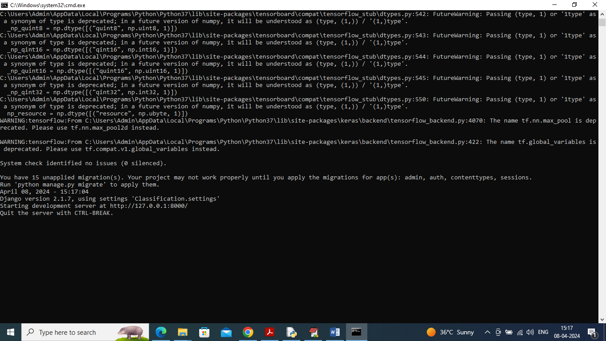
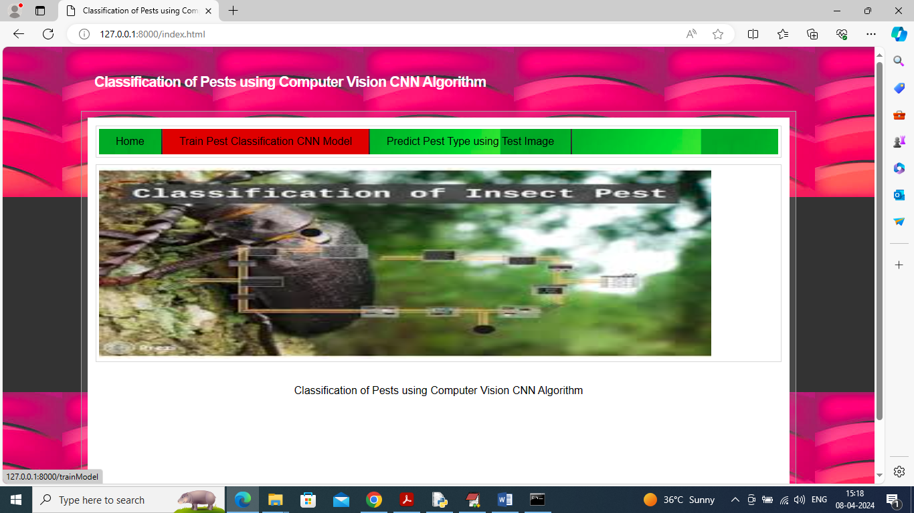
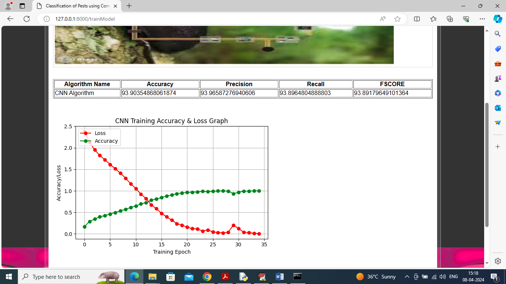
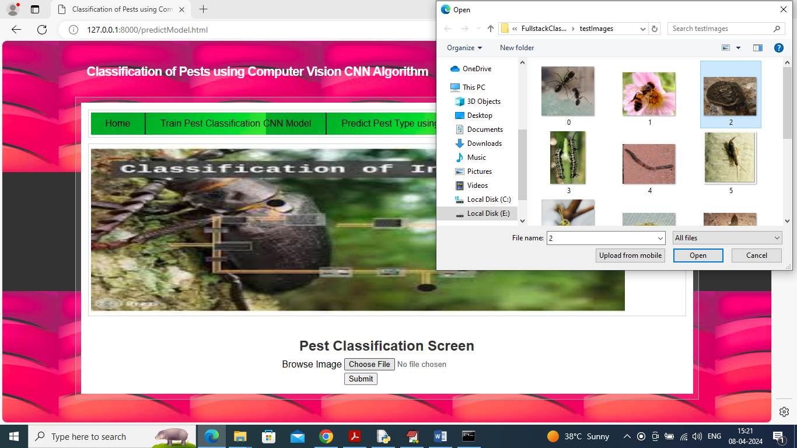
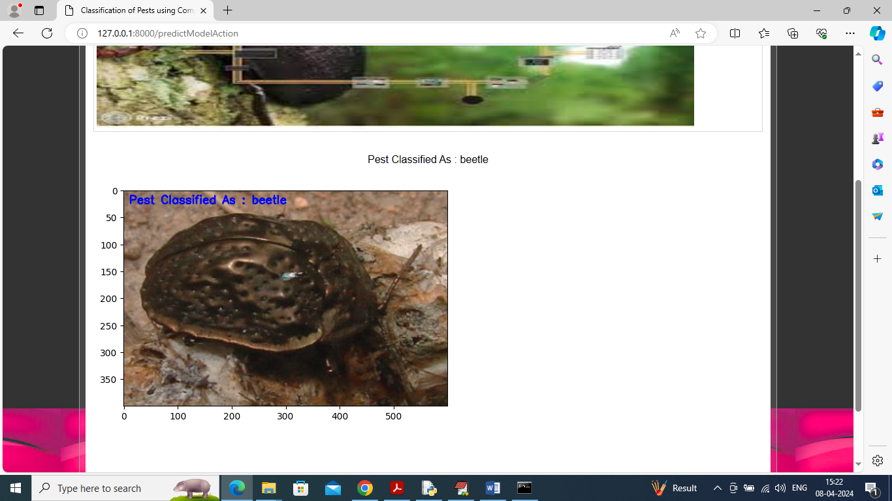
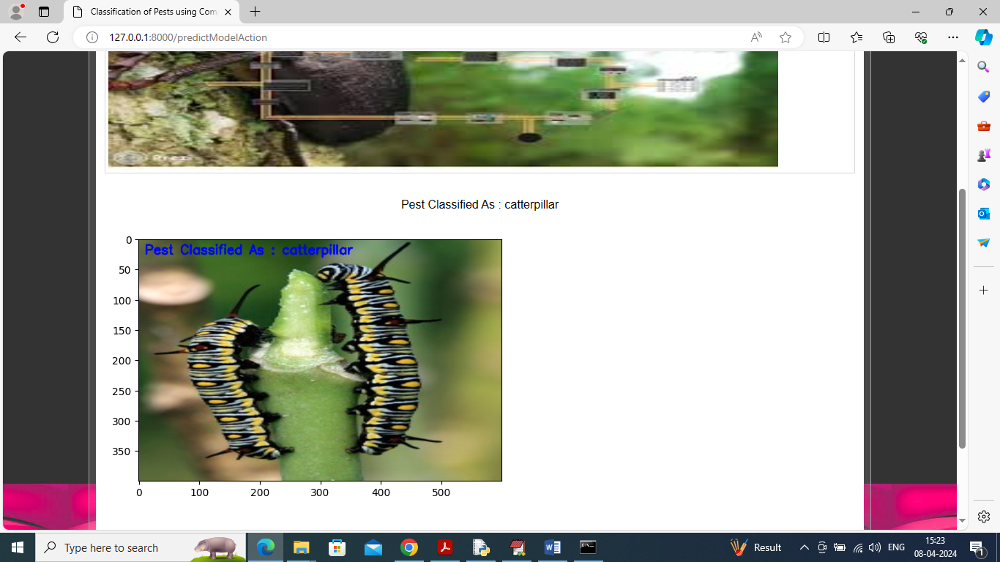
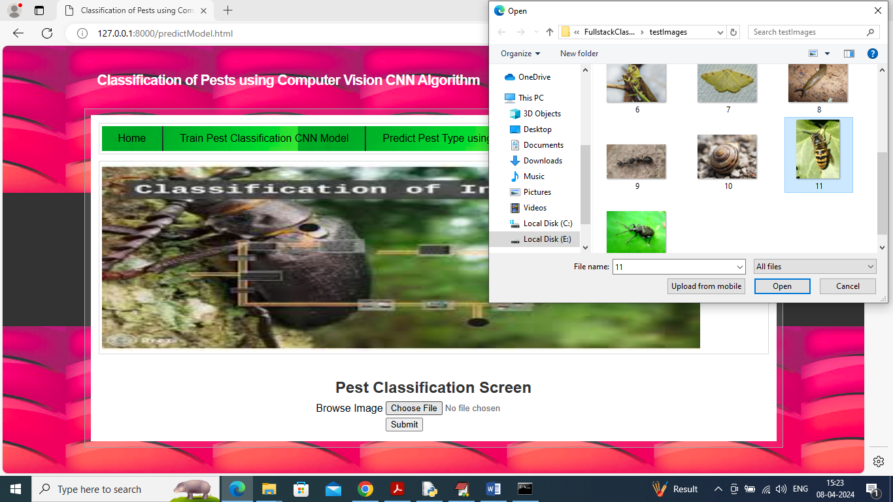
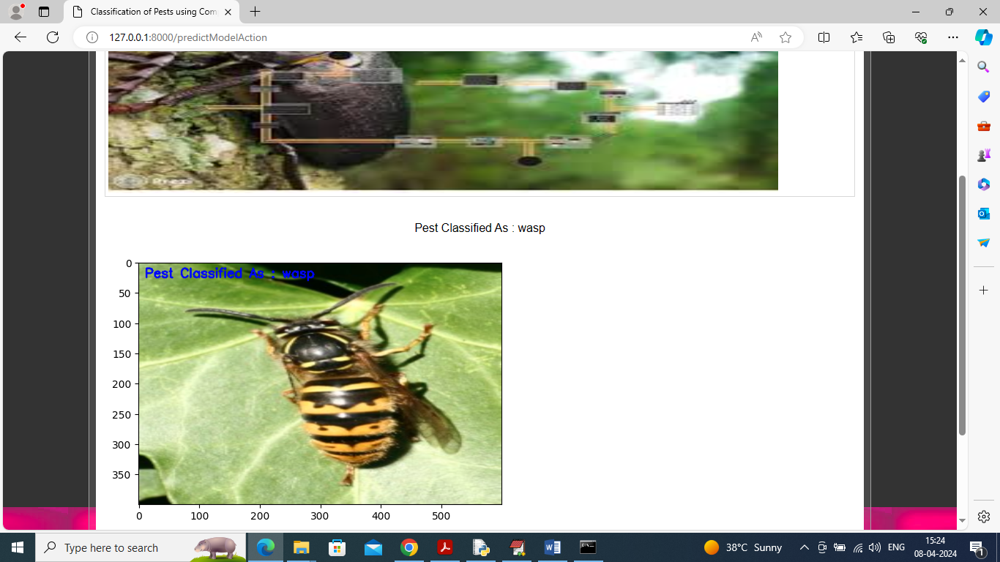

# Pest Classification Using Computer Vision (CNN)

This project is a web-based application developed using Django and Keras for classifying pests in images using Convolutional Neural Networks (CNN). The system uses pre-trained models to classify pests and provides insights into the classification performance with accuracy, precision, recall, and F1 score.

## Features

- **Pest Classification**: Upload an image, and the system classifies the pest based on the model.
- **Model Training**: The CNN model can be trained on a dataset of images, with training accuracy and loss displayed in a graph.
- **Performance Metrics**: After training the model, the system shows the model's accuracy, precision, recall, and F1 score.

## Technologies Used

- **Backend**: Django
- **Machine Learning**: Keras, TensorFlow, OpenCV, NumPy
- **Frontend**: HTML, CSS, JavaScript (for visualization)
- **Other**: Matplotlib (for plotting training graphs)

## Dataset

The dataset for training the model contains various pest images stored in the `Dataset` folder. Each pest is classified under its respective category.

## Setup Instructions

### Prerequisites

- Python 3.7
- Django
- Keras
- TensorFlow
- OpenCV
- Matplotlib
- scikit-learn
- Other necessary libraries (refer to requirements.txt)

### Installation

1. Clone the repository:
   bash
   git clone https://github.com/yourusername/pest-classification.git
   cd pest-classification
   

2. Install the required dependencies:
   bash
   pip install -r requirements.txt
   

3. Set up the Django database (if applicable) and static files:
   bash
   python manage.py migrate
   python manage.py collectstatic
   

4. Train the CNN model (optional, if not already trained):
   bash
   python manage.py runserver
   

### Running the Application

1. Start the Django development server:
   bash
   python manage.py runserver
   

2. Open a browser and navigate to `http://127.0.0.1:8000/` to view the home page.

3. Use the "Train Model" page to train the CNN model or the "Predict Model" page to classify a pest image.

## Model Architecture

The CNN model consists of:
- Two convolutional layers followed by max-pooling layers
- A fully connected dense layer for classification
- The model is compiled using the Adam optimizer and categorical cross-entropy loss function.

### Metrics

- **Accuracy**: Measures the overall performance of the model.
- **Precision**: Evaluates the model’s ability to correctly classify positive samples.
- **Recall**: Measures how well the model identifies all positive samples.
- **F1 Score**: The harmonic mean of precision and recall.

## Contributing

- **CH.THANMAI**
- **K.YUVRAJ**
- **Bhavya**
- **[Shashidhar](https://github.com/reddynalamari)**

## License

This project is licensed under the MIT License - see the [LICENSE](LICENSE) file for details.

## Screens
To run project double click on ‘run.bat’ file to start python server 
 
Main page 
 
CNN model training and accuracy 
 
Uploading Test images 
 
Pest classify as ‘beetle’ 
 
Pest classify as ‘Caterpillar’ 
 
Screen uploading another image 
 
Pest classified as ‘wasp’. 
 
